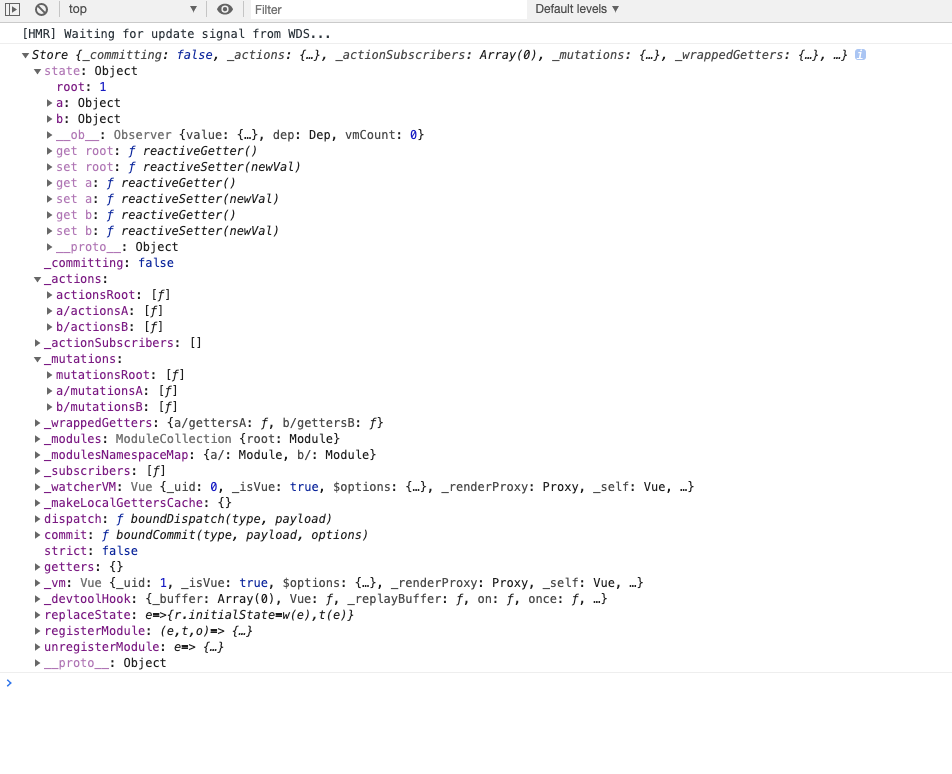

## vuex源码分析

本文从源码角度一步一步的分析vuex处理的过程，下面的代码会切分的比价碎，希望大家`git clone https://github.com/vuejs/vuex.git`源码之后 一步一步调试

### 使用
首先我们看看vuex的使用
```js
import Vue from "vue";
import Vuex from "vuex";

Vue.use(Vuex);

const modulesA: {
  state: {},
  mutations: {},
  actions: {},
  modules: {},
}

const modulesB: {
  state: {},
  mutations: {},
  actions: {},
  modules: {},
}

const store = new Vuex.Store({
  modules: {
    a: modulesA,
    b: modulesB
  },
  state: {},
  mutations: {},
  actions: {},
  modules: {},
});

new Vue({
  router,
  store,
  render: h => h(App),
}).$mount("#app");
```
在vue文件中 我们先引入`vuex`，然后注册`vue.use(vuex)`注册，然后使用`new Vuex.Store`实例化store，最后将store传到vue options中；

### index.js
首先我们查看vuex的源码package.json
```
{
  "name": "vuex",
  "version": "3.1.3",
  "description": "state management for Vue.js",
  "main": "dist/vuex.common.js",
  "module": "dist/vuex.esm.js",
  ....
}
```
发现入口为打包文件，源入口为`src/index.js`
```
import { Store, install } from './store'
import { mapState, mapMutations, mapGetters, mapActions, createNamespacedHelpers } from './helpers'

export default {
  Store,
  install,
  version: '__VERSION__',
  mapState,
  mapMutations,
  mapGetters,
  mapActions,
  createNamespacedHelpers
}
```
vuex返回一个对象，其中为我们常用的一些方法。
当我们使用`vue.use(vuex)`安装注册vuex的时候，我们会调用install方法

##### src/store.js
```
export function install (_Vue) {
  if (Vue && _Vue === Vue) {
    if (process.env.NODE_ENV !== 'production') {
      console.error(
        '[vuex] already installed. Vue.use(Vuex) should be called only once.'
      )
    }
    return
  }
  Vue = _Vue
  applyMixin(Vue)
}
```
首先会判断Vue是否被重复调用，然后执行`applyMixin(Vue)`

##### src/mixin.js
```
export default function (Vue) {
  const version = Number(Vue.version.split('.')[0])

  if (version >= 2) {
    Vue.mixin({ beforeCreate: vuexInit })
  } else {
    // override init and inject vuex init procedure
    // for 1.x backwards compatibility.
    const _init = Vue.prototype._init
    Vue.prototype._init = function (options = {}) {
      options.init = options.init
        ? [vuexInit].concat(options.init)
        : vuexInit
      _init.call(this, options)
    }
  }

  /**
   * Vuex init hook, injected into each instances init hooks list.
   */

  function vuexInit () {
    const options = this.$options
    // store injection
    if (options.store) {
      this.$store = typeof options.store === 'function'
        ? options.store()
        : options.store
    } else if (options.parent && options.parent.$store) {
      this.$store = options.parent.$store
    }
  }
}
```
因为vue `1.x`和 `2.x`都是使用了同一个vuex，所以我们在初始化的时候判断一下版本，我们不讨论1.x，当vue版本为2.x的时候，我们是用Vue.mixin进行全局混入，然后在全局的`beforeCreate`生命周期的时候执行`vuexInit`函数。
在vuexInit函数中首先我们获取参数，判断参数中是否有`store`,如果有，挂载到this.$store上，这样我们每一个vue组件中都可以使用 this.$store获取store实例。
接下来我们看看store实例的内容，通过初始化我们发现store实例是通过new Vuex.Store创建的，所以我们看一下store构造函数；

### Store 实例化
```
constructor (options = {}) {
    // Auto install if it is not done yet and `window` has `Vue`.
    // To allow users to avoid auto-installation in some cases,
    // this code should be placed here. See #731
    if (!Vue && typeof window !== 'undefined' && window.Vue) {
      install(window.Vue)
    }

    if (process.env.NODE_ENV !== 'production') {
      assert(Vue, `must call Vue.use(Vuex) before creating a store instance.`)
      assert(typeof Promise !== 'undefined', `vuex requires a Promise polyfill in this browser.`)
      assert(this instanceof Store, `store must be called with the new operator.`)
    }

    const {
      plugins = [],
      strict = false
    } = options

    // store internal state
    this._committing = false
    this._actions = Object.create(null)
    this._actionSubscribers = []
    this._mutations = Object.create(null)
    this._wrappedGetters = Object.create(null)
    this._modules = new ModuleCollection(options)
    this._modulesNamespaceMap = Object.create(null)
    this._subscribers = []
    this._watcherVM = new Vue()
    this._makeLocalGettersCache = Object.create(null)

    // bind commit and dispatch to self
    const store = this
    const { dispatch, commit } = this
    this.dispatch = function boundDispatch (type, payload) {
      return dispatch.call(store, type, payload)
    }
    this.commit = function boundCommit (type, payload, options) {
      return commit.call(store, type, payload, options)
    }

    // strict mode
    this.strict = strict

    const state = this._modules.root.state

    // init root module.
    // this also recursively registers all sub-modules
    // and collects all module getters inside this._wrappedGetters
    installModule(this, state, [], this._modules.root)

    // initialize the store vm, which is responsible for the reactivity
    // (also registers _wrappedGetters as computed properties)
    resetStoreVM(this, state)

    // apply plugins
    plugins.forEach(plugin => plugin(this))

    const useDevtools = options.devtools !== undefined ? options.devtools : Vue.config.devtools
    if (useDevtools) {
      devtoolPlugin(this)
    }
  }
```
乍一看代码一大坨，好像不知道它做了什么， 别急，我们慢慢分析。
首先
```
if (!Vue && typeof window !== 'undefined' && window.Vue) {
  install(window.Vue)
}
```
主要的目的是为了Vue不是使用import引入，有可能使用cdn或者本地文件的方式，我们判断window上是否存在Vue，然后手动的去执行install。

```
// store internal state
this._committing = false
this._actions = Object.create(null)
this._actionSubscribers = []
this._mutations = Object.create(null)
this._wrappedGetters = Object.create(null)
this._modules = new ModuleCollection(options)
this._modulesNamespaceMap = Object.create(null)
this._subscribers = []
this._watcherVM = new Vue()
this._makeLocalGettersCache = Object.create(null)
```
这部分其实就是初始化一些变量，细心的人可能会发现 这些变量就是我们new Store传的参数 `action` `mutations` `modules` 已经一些方法 `actionSubscribers` `subscribers`等。

当我们store结构很复杂的时候，我们会使用`modules`做空间管理，举个例子如果store为一个大的仓库，那么`modules`是子仓库，里面的操作和store一样；

ok 首先我们从modules入手，从上面源码中我们能看出来`this._modules = new ModuleCollection(options)`与modules有缘，现在我们了解一下ModuleCollection(options)
##### src/module/module-collection.js
```
import Module from './module'
import { assert, forEachValue } from '../util'

export default class ModuleCollection {
  constructor (rawRootModule) {
    // register root module (Vuex.Store options)
    this.register([], rawRootModule, false)
  }

  get (path) {
    return path.reduce((module, key) => {
      return module.getChild(key)
    }, this.root)
  }

  getNamespace (path) {
    let module = this.root
    return path.reduce((namespace, key) => {
      module = module.getChild(key)
      return namespace + (module.namespaced ? key + '/' : '')
    }, '')
  }

  update (rawRootModule) {
    update([], this.root, rawRootModule)
  }

  register (path, rawModule, runtime = true) {
    if (process.env.NODE_ENV !== 'production') {
      assertRawModule(path, rawModule)
    }

    const newModule = new Module(rawModule, runtime)
    if (path.length === 0) {
      this.root = newModule
    } else {
      const parent = this.get(path.slice(0, -1))
      parent.addChild(path[path.length - 1], newModule)
    }

    // register nested modules
    if (rawModule.modules) {
      forEachValue(rawModule.modules, (rawChildModule, key) => {
        this.register(path.concat(key), rawChildModule, runtime)
      })
    }
  }

  unregister (path) {
    const parent = this.get(path.slice(0, -1))
    const key = path[path.length - 1]
    if (!parent.getChild(key).runtime) return

    parent.removeChild(key)
  }
}

...
```
我截取了`ModuleCollection`构造函数，从初始的文件我们知道`options`参数也就是ModuleCollection接收的`rawRootModule`其实是我们new vuex.Store传的内容：
```
const store = new Vuex.Store({
  modules: {
    a: modulesA,
    b: modulesB
  },
  state: {},
  mutations: {},
  actions: {},
  modules: {},
});
```
当我们进入ModuleCollection的时候，其实是执行了`this.register([], rawRootModule, false)`这个函数，当我们执行了这个函数的时候，首先我们判断了环境，然后执行了`const newModule = new Module(rawModule, runtime)`这个函数，这个构造函数其实是：

##### src/module/module.js
```
import { forEachValue } from '../util'

// Base data struct for store's module, package with some attribute and method
export default class Module {
  constructor (rawModule, runtime) {
    this.runtime = runtime
    // Store some children item
    this._children = Object.create(null)
    // Store the origin module object which passed by programmer
    this._rawModule = rawModule
    const rawState = rawModule.state

    // Store the origin module's state
    this.state = (typeof rawState === 'function' ? rawState() : rawState) || {}
  }

  get namespaced () {
    ...
  }

  addChild (key, module) {
    ...
  }

  removeChild (key) {
    ...
  }

  getChild (key) {
    ...
  }

  update (rawModule) {
    ...
  }

  forEachChild (fn) {
    ...
  }

  forEachGetter (fn) {
    ...
  }

  forEachAction (fn) {
    ...
  }

  forEachMutation (fn) {
    ...
  }
}
```
从源码中我们知道Module其实是处理了初始化的options传给了_rawModule，然后将初始化的state给了rawState。
接下来我们接着看src/module/module-collection.js文件中register函数，初始化的时候`register (path, rawModule, runtime = true) {}`,path 为一个[],所以顺序执行到
```
if (path.length === 0) {
  this.root = newModule
} else {
  const parent = this.get(path.slice(0, -1))
  parent.addChild(path[path.length - 1], newModule)
}
```
this.root为初始化的`new Module(rawModule, runtime)`返回的实例，this.root实例化对象。
接下来我们执行：
```
if (rawModule.modules) {
  forEachValue(rawModule.modules, (rawChildModule, key) => {
    this.register(path.concat(key), rawChildModule, runtime)
  })
}
```
也就是实例化参数的
```
modules: {
  a: modulesA,
  b: modulesB
},
```
因为`rawModule.modules`有内容，所以执行了内容遍历，也就是子模块开始递归，当子模块重复执行的时候，又开始执行`this.register(path.concat(key), rawChildModule, runtime)`这段代码，但是此时会执行
```
if (path.length === 0) {
  this.root = newModule
} else {
  const parent = this.get(path.slice(0, -1))
  parent.addChild(path[path.length - 1], newModule)
}
```
这段代码的else阶段，因为每次都是往`path`中重新添加，所以每次以
`path.slice(0, -1)`获取最后一个，然后以`this.get(path.slice(0, -1))`拿到`a`然后往this.root中添加内容，我们刚开始知道this.root为一个对象，然后`this.get(path.slice(0, -1))`其实是添加children,字段为module,我们调试之后可以知道：


其实就是this.root下面添加两个modules的实例化`a`,`b`,这样使得
```
const store = new Vuex.Store({
  modules: {
    a: modulesA,
    b: modulesB
  }
}
```
`store`与`modules`创建了父子关系的过程；

当我们了解了
```
this._modules = new ModuleCollection(options)`
```
这个之后我们往下面看
```
const store = this
const { dispatch, commit } = this
this.dispatch = function boundDispatch (type, payload) {
  return dispatch.call(store, type, payload)
}
this.commit = function boundCommit (type, payload, options) {
  return commit.call(store, type, payload, options)
}
```
我们会处理disptch,commit,这两个其实就是修改了执行环境为store

#### installModule
```
installModule(this, state, [], this._modules.root)
```
其实这里面就是对`action` `mutations` `modules`的注册等

我们首先看参数`(this, state, [], this._modules.root)`
```
function installModule (store, rootState, path, module, hot) {
  const isRoot = !path.length
  const namespace = store._modules.getNamespace(path)

  // register in namespace map
  if (module.namespaced) {
    if (store._modulesNamespaceMap[namespace] && process.env.NODE_ENV !== 'production') {
      console.error(`[vuex] duplicate namespace ${namespace} for the namespaced module ${path.join('/')}`)
    }
    store._modulesNamespaceMap[namespace] = module
  }

  // set state
  if (!isRoot && !hot) {
    const parentState = getNestedState(rootState, path.slice(0, -1))
    const moduleName = path[path.length - 1]
    store._withCommit(() => {
      if (process.env.NODE_ENV !== 'production') {
        if (moduleName in parentState) {
          console.warn(
            `[vuex] state field "${moduleName}" was overridden by a module with the same name at "${path.join('.')}"`
          )
        }
      }
      Vue.set(parentState, moduleName, module.state)
    })
  }

  const local = module.context = makeLocalContext(store, namespace, path)

  module.forEachMutation((mutation, key) => {
    const namespacedType = namespace + key
    registerMutation(store, namespacedType, mutation, local)
  })

  module.forEachAction((action, key) => {
    const type = action.root ? key : namespace + key
    const handler = action.handler || action
    registerAction(store, type, handler, local)
  })

  module.forEachGetter((getter, key) => {
    const namespacedType = namespace + key
    registerGetter(store, namespacedType, getter, local)
  })

  module.forEachChild((child, key) => {
    installModule(store, rootState, path.concat(key), child, hot)
  })
}
```
首先我们先看看`const namespace = store._modules.getNamespace(path)` 这样做的目的其实是获取每个模块的空间
```
const store = new Vuex.Store({
  modules: {
    a: modulesA,
    b: modulesB
  },
});

其实这里面modules的空间为 root a b 这一步就是为了获取每个modules的空间 即 root a b
```
然后根据root a b三个modules空间去合并`registerMutation` `registerAction` `registerGetter` 然后重复操作
```
module.forEachChild((child, key) => {
  installModule(store, rootState, path.concat(key), child, hot)
})
```

我们可以出来action mutations getter等做了合并，添加了namespace，做了参数合并。

